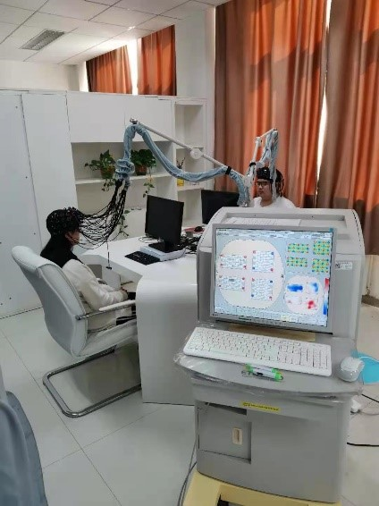
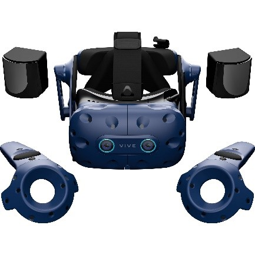
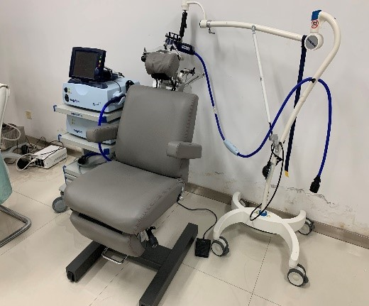
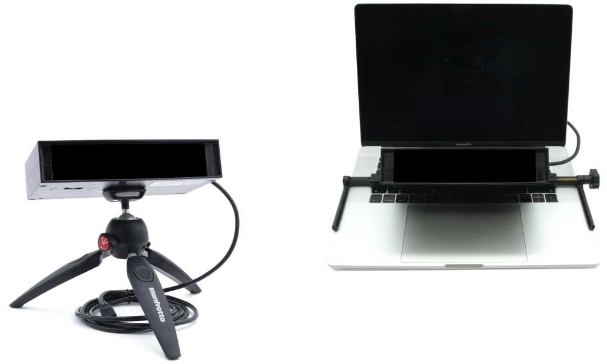
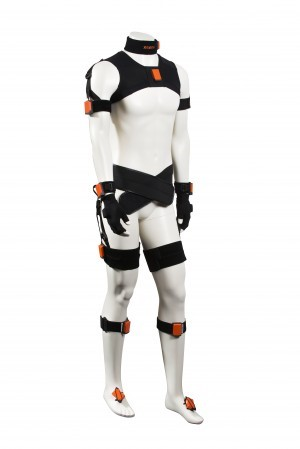

---
# A section created with the Portfolio widget.
# This section displays content from `content/project/`.
# See https://wowchemy.com/docs/widget/portfolio/
widget: blank

# This file represents a page section.
headless: false

# Order that this section appears on the page.
weight: 20

title: 'Equipment'
subtitle: ''

design:
  columns: '1'
  view: compact
---
<html>
<head>

</head>
<body>

<ul class="list-unstyled">
  <li class="media">
    
    

      <h5 class="mt-0 mb-1">Functional near-infrared spectroscopy</h5>
      fNIRS (functional near-infrared spectroscopy) is a non-invasive neuroimaging technique that measures brain responses by recording changes in the amount of oxygenated/deoxygenated blood. It works based on the principle of light scattering – the device sends high intensity beams of near-infrared light at the scalp and detects changes to amount of light absorbed within the brain. Mathematical algorithms are then applied to process the collected data to calculate changes in oxygenated/deoxygenated haemoglobin concentration. These changes are associated with changes in brain function.
    

  </li>
  <li class="media my-4">
    
    

      <h5 class="mt-0 mb-1">HTC Vive Pro</h5>
      A virtual reality technology product released by HTC. This product has built-in headphones, and only needs to use a cable to connect a high-performance PC computer to present a high-resolution picture.
    

  </li>
  <li class="media my-4">
    
    

      <h5 class="mt-0 mb-1">Transcranial Magnetic Stimulator(TMS)</h5>
      Transcranial magnetic stimulation technology uses pulsed magnetic fields to act on the central nervous system (mainly the brain) to change the membrane potential of cortical nerve cells, causing them to generate induced currents, affecting brain metabolism and neural electrical activity, thereby causing a series of physiological and biochemical reactions.
    

  </li>
  <li class="media my-4">
    
    

      <h5 class="mt-0 mb-1">Eyelink Portable Duo Eye Tracker</h5>
      The eyelink portable duo eye tracker's high-speed and low-noise eye tracking algorithm supports two data acquisition modes: head stabilization (up to 2000 Hz) and telemetry (1000 Hz). It adopts a portable eye tracking solution. It can provide highly reliable and high-precision data required by scientific research, and can be used for laboratory or non-laboratory research.
    

  </li>
  <li class="media my-4">
    
    

      <h5 class="mt-0 mb-1">MVN Awinda motion capture system</h5>
      MVN Awinda motion capture system is composed of XSENS inertial sensor and MVN software, which can adapt to almost any environment, and can capture very small flutter, and also can capture large amplitude motion.
    

  </li>
</ul>

</body>
</html>
