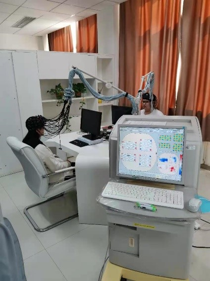
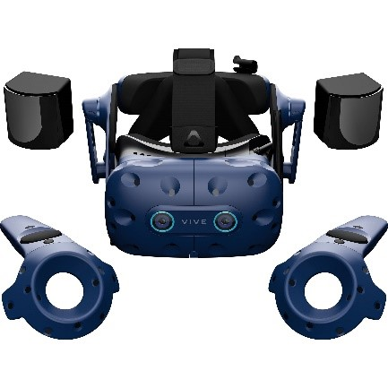
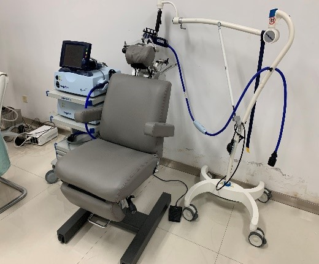
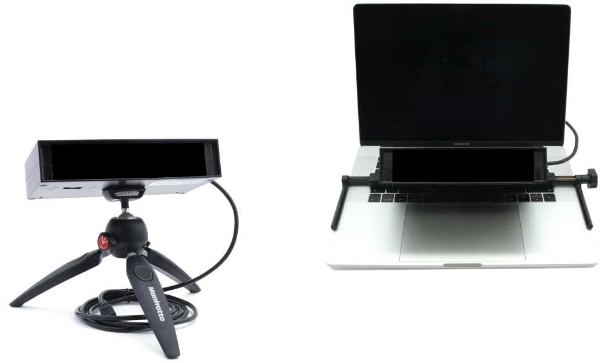
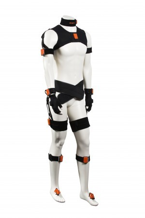

---
# A section created with the Portfolio widget.
# This section displays content from `content/project/`.
# See https://wowchemy.com/docs/widget/portfolio/
widget: blank

# This file represents a page section.
headless: false

# Order that this section appears on the page.
weight: 20

title: '研究设备'
subtitle: ''

design:
  columns: '1'
  view: compact
---

<html>
<head>

</head>
<body>

  

    
    

      <h5 class="card-title">功能性近红外脑成像系统</h5>
      
fNIRS（功能性近红外光谱）是一种非侵入性神经成像技术，通过记录含氧/脱氧血液量的变化来测量大脑反应。 它基于光散射原理工作——该设备向头皮发射高强度近红外光束，并检测大脑吸收的光量变化。 然后应用数学算法来处理收集到的数据，以计算含氧/脱氧血红蛋白浓度的变化。这些变化与大脑功能的变化有关。

    

  

  

    
    

      <h5 class="card-title">HTC Vive Pro</h5>
      
由HTC公司发布的一款虚拟现实技术产品。这款产品内置耳机，且仅需要使用一根线缆连接一台高性能的PC电脑即可呈现拥有高分辨率的画面。

    

  

  

    
    

      <h5 class="card-title">TMS经颅磁刺激仪</h5>
      
经颅磁刺激技术利用脉冲磁场作用于中枢神经系统（主要是大脑）以改变皮层神经细胞的膜电位，使之产生感应电流，影响脑内代谢和神经电活动，从而引起一系列生理生化反应。

    

  

  

    
    

      <h5 class="card-title">Eyelink Portable Duo 眼动仪</h5>
      
Eyelink Portable Duo 眼动仪提供高速和低噪的眼动追踪算法支持头部稳定和遥测两种数据采集模式，采用便携的眼动追踪解决方案，适用多种研究场景，提供科研所需的高可靠和高精度数据；头部稳定模式支持高达2000 Hz的双眼追踪可用于实验室或非实验室研究，遥测模式支持1000 Hz的双眼追踪。

    

  

  

    
    

      <h5 class="card-title">MVN Awinda三维运动捕捉系统</h5>
      
MVN Awinda运动捕捉系统由XSENS惯性传感器和MVN软件组成，可以适应几乎任何环境，可以捕捉非常微小的颤动，也可以捕捉大幅度的运动。

    

  

<ul class="list-unstyled">
  <li class="media">
    
    

      <h5 class="mt-0 mb-1">功能性近红外脑成像系统</h5>
      fNIRS（功能性近红外光谱）是一种非侵入性神经成像技术，通过记录含氧/脱氧血液量的变化来测量大脑反应。 它基于光散射原理工作——该设备向头皮发射高强度近红外光束，并检测大脑吸收的光量变化。 然后应用数学算法来处理收集到的数据，以计算含氧/脱氧血红蛋白浓度的变化。这些变化与大脑功能的变化有关。
    

  </li>
  <li class="media my-4">
    
    

      <h5 class="mt-0 mb-1">HTC Vive Pro</h5>
      由HTC公司发布的一款虚拟现实技术产品。这款产品内置耳机，且仅需要使用一根线缆连接一台高性能的PC电脑即可呈现拥有高分辨率的画面。
    

  </li>
  <li class="media">
    
    

      <h5 class="mt-0 mb-1">TMS经颅磁刺激仪</h5>
      经颅磁刺激技术利用脉冲磁场作用于中枢神经系统（主要是大脑）以改变皮层神经细胞的膜电位，使之产生感应电流，影响脑内代谢和神经电活动，从而引起一系列生理生化反应。
    

  </li>
  <li class="media">
    
    

      <h5 class="mt-0 mb-1">Eyelink Portable Duo</h5>
      Eyelink Portable Duo 眼动仪提供高速和低噪的眼动追踪算法支持头部稳定和遥测两种数据采集模式，采用便携的眼动追踪解决方案，适用多种研究场景，提供科研所需的高可靠和高精度数据；头部稳定模式支持高达2000 Hz的双眼追踪可用于实验室或非实验室研究，遥测模式支持1000 Hz的双眼追踪。
    

  </li>
  <li class="media">
    
    

      <h5 class="mt-0 mb-1">MVN Awinda三维运动捕捉系统</h5>
      MVN Awinda运动捕捉系统由XSENS惯性传感器和MVN软件组成，可以适应几乎任何环境，可以捕捉非常微小的颤动，也可以捕捉大幅度的运动。
    

  </li>
</ul>

</body>
</html>